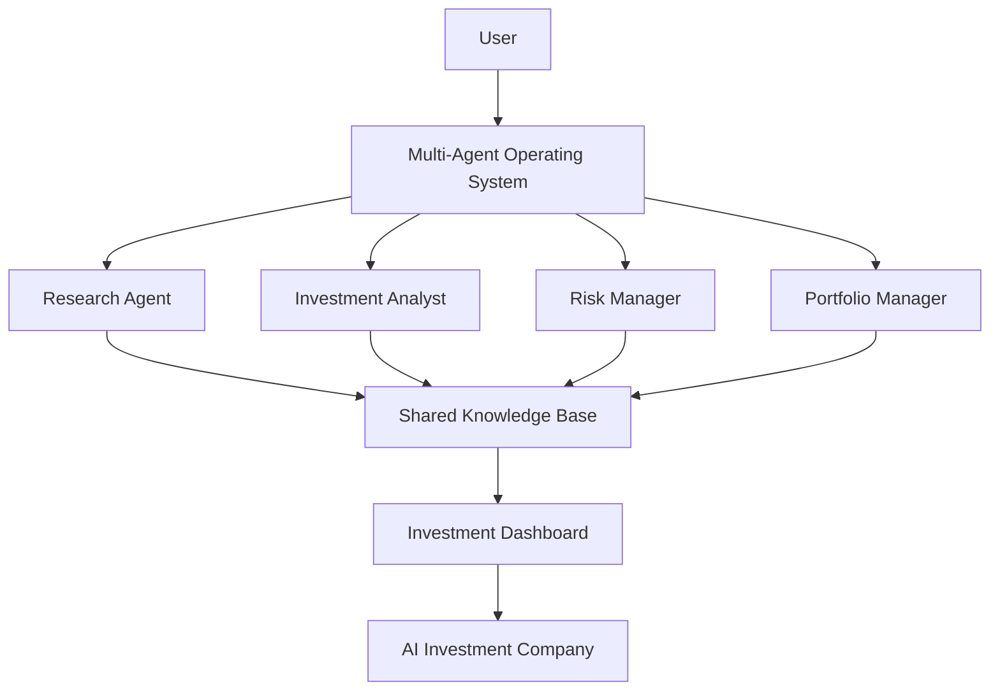

# Multi-Agent Operating System

> A modular AI Operating System for autonomous AI agent orchestration.

---

## 🎯 Project Vision

Multi-Agent Operating System (MAOS) is a personal AI engineering project focused on building a modular operating system where multiple AI agents collaborate to solve complex tasks.

Rather than creating a single AI assistant, MAOS provides a reusable architecture that supports different AI-powered applications.

The first application built on this platform is **AI Investment Company**, an autonomous investment research system designed to automate research, analysis, reporting and investment decision support.

---

## 🚀 Current Development Stage

Current Version: **v0.5 Prototype**

Current Sprint: **Sprint 1 – Documentation & System Architecture**

Status: 🟢 Active Development

---

## 📌 Project Goals

- Build a reusable Multi-Agent Operating System
- Design specialised AI agents with clear responsibilities
- Develop autonomous investment research workflows
- Integrate Python automation and AI APIs
- Deploy a production-ready AI engineering portfolio

---

## 🏗️ System Architecture

---

## 🤖 AI Agents

Coming Soon

---

## 📈 Applications

### AI Investment Company

Coming Soon

---

## 🛠️ Technology Stack

Coming Soon

---

## 🗺️ Roadmap

Coming Soon
